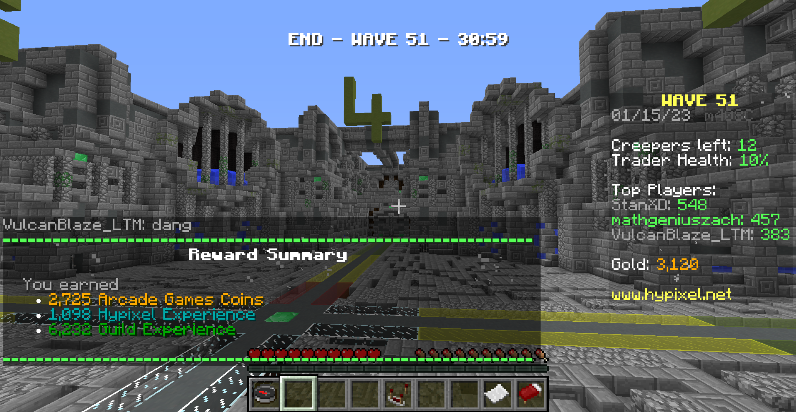

# Creeper Attack HUD

*CAHUD* - That's coughing, but very weirdly

This is a 1.8 mod that provides useful information for Hypixel's Creeper Attack on your HUD.

In text, it provides this information on your HUD:
- Game time and player count info
- Status of the game, whether you are in lobby, an intermission (with an accurate timer), wave, or ending
- Mob counts of the next wave, if you are in an intermission
- In a wave, the number of creepers that have spawned and will spawn, and which lanes are done spawning creepers
- In a wave, the number of blazes that have spawned and will spawn
- In a wave, the number of zombies that your client has seen spawn
- Timers showing when the next mini-wave of creepers/a blaze will spawn, and when the next mini-wave of zombies will spawn
- For advanced play, a mid-rotation turn marker on the screen (off by default).

The mod also plays two configurable sound effects when:
- A mini-wave of creepers - and potentially a blaze - spawn
- Iron Golems spawn

On an unrelated note, you should also check out my 1.8 [ModernInfo](https://github.com/xMGZx/ModernInfo) mod, which provides critical information about your bow charge rate (the last sprite shows at 90% charged, while a crit arrow requires you to hold the bow 2 ticks longer) and potential to melee, and reveals all mobs' custom name tags from everywhere (so you can see creeper attack mob health everywhere).

## Contact

Contact me on [Discord](https://discord.gg/pBFqEcXvW5) and support me on [Ko-Fi](https://ko-fi.com/mathgeniuszach)!

## Screenshots

